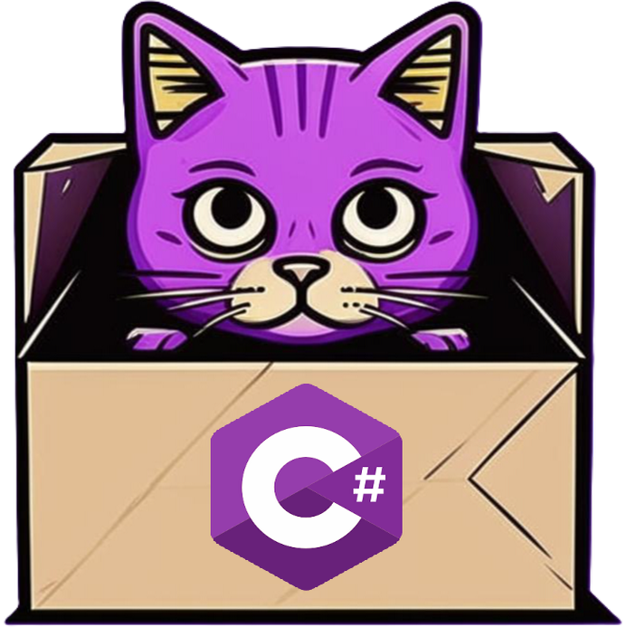

#  Build automation system for .NET

[](https://www.nuget.org/packages/dotnet-csi)  [](http://teamcity.jetbrains.com/viewType.html?buildTypeId=OpenSourceProjects_DevTeam_CScriptInteractive_BuildAndTest&guest=1)



This is a repository of dotnet-csi which is an interactive tool for running C# scripts. It can installed as a command-line tool on Windows, Linux, or macOS.

## Prerequisites

The tool requires [.NET 6+ runtime](https://dotnet.microsoft.com/en-us/download).

## Usage

### Script runner

After installing tool you can use this tool to run C# scripts from the command line. dotnet-csi is available as a [NuGet package](https://www.nuget.org/packages/dotnet-csi/).

Before installing dotnet-csi as a local tool dot not forget to create .NET local tool manifest file if it is not exist:

```Shell
dotnet new tool-manifest
```

Install the tool and add to the local tool manifest:

```Shell
dotnet tool install dotnet-csi
```

Or install the tool for the current user:

```Shell
dotnet tool install dotnet-csi -g
```

Launch the tool in the interactive mode:

```Shell
dotnet csi
```

Run a specified script with a given argument:

```Shell
dotnet csi Samples/Scripts/hello.csx World 
```

Run a single script located in the _MyDirectory_ directory:

```Shell
dotnet csi Samples/Build
```

Usage:

```Shell
dotnet csi [options] [--] [script] [script arguments]
```

Executes a script if specified, otherwise launches an interactive REPL (Read Eval Print Loop).

Supported arguments:

| Option                  | Description                                                                                                                                                     | Alternative form                                                                              |
|:------------------------|-----------------------------------------------------------------------------------------------------------------------------------------------------------------|-----------------------------------------------------------------------------------------------|
| script                  | The path to the script file to run. If no such file is found, the command will treat it as a directory and look for a single script file inside that directory. |                                                                                               |
| script arguments        | Script arguments are accessible in a script via the global list Args[index] by an argument index.                                                               |                                                                                               |
| --                      | Indicates that the remaining arguments should not be treated as options.                                                                                        |                                                                                               |
| --help                  | Show how to use the command.                                                                                                                                    | `/?`, `-h`, `/h`, `/help`                                                                     |
| --version               | Display the tool version.                                                                                                                                       | `/version`                                                                                    |
| --source                | Specify the NuGet package source to use. Supported formats: URL, or a UNC directory path.                                                                       | `-s`, `/s`, `/source`                                                                         |
| --property <key=value>  | Define a key-value pair(s) for the script properties called _Props_, which is accessible in scripts.                                                            | `-p`, `/property`, `/p`                                                                       |
| --property:<key=value>  | Define a key-value pair(s) in MSBuild style for the script properties called _Props_, which is accessible in scripts.                                           | `-p:<key=value>`, `/property:<key=value>`, `/p:<key=value>`, `--property:key1=val1;key2=val2` |
| @file                   | Read the response file for more options.                                                                                                                        |                                                                                               |

```using HostApi;``` directive in a script allows you to use host API types without specifying the fully qualified namespace of these types.

### .NET application

Install the C# script template [CSharpInteractive.Templates](https://www.nuget.org/packages/CSharpInteractive.Templates)

```shell
dotnet new -i CSharpInteractive.Templates
```

Create a console project "Build" containing a script from the template *__build__*

```shell
dotnet new build -o ./Build
```

This projects contains the script *__./Build/Program.csx__*. To run this script from the command line from the directory *__Build__*:

```shell
dotnet csi Build
```

To run as a .NET console application:

```shell
dotnet run --project Build
```

