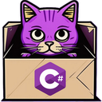

#  Build automation system for .NET

[](https://www.nuget.org/packages/dotnet-csi)

[](http://teamcity.jetbrains.com/viewType.html?buildTypeId=OpenSourceProjects_DevTeam_CScriptInteractive_BuildAndTest&guest=1)


C# interactive build automation system makes it easy to build .NET projects. It can be part of your solution as a regular console cross-platform .NET application, run C# scripts without compiling them, or even run in REPL mode - allowing you to run C# interactively.



## Advantages

- [X] 3 compatible [operating modes](#operating-modes)
- [X] .NET console application [project](#net-build-project)
- [X] Part of .NET solution
- [X] C#
- [X] Cross-platform
- [X] Debugging capability
- [X] No model binding (Task, Target, DependsOn, etc.)
  - no restrictions
  - no learning curve
  - can use common .NET development practices
- [X] Simple and powerful API for building .NET projects
- [X] Passing named parameters as in MSBuild
- [X] Summarised statistics as in MSBuild
  - Child processes 
  - Warnings and errors
  - Tests
  - Execution time
- [X] CI/CD integration
  - GitLab/GitHub Actions/JetBrains Space etc.
  - TeamCity 
    - [Special runner](https://jetbrains.com/help/teamcity/c-script.html#C%23+Script+Settings) 
    - Report on warnings and errors
    - Test statistics
    - Execution progress
    - Real-time integration
    - Parameters passing between build configuration steps

## Operating modes

- [REPL](#script-runner-and-repl-tool)
- [C# scripts running](#script-runner-and-repl-tool)
- [.NET build project](#net-build-project)

These modes are practically compatible, i.e., for example, a script can be run as a .NET project, and vice versa, with minimal or no changes.

## API
- Output, logging and tracing
- Arguments and parameters
- Command line
- Docker
- Microsoft DI API to resolve dependencies
- NuGet
- .NET CLI

```c#
// This directive in a script allows you to use host API types
// without specifying the fully qualified namespace of these types
using HostApi;

// Output, logging and tracing API
WriteLine("Hello");
WriteLine("Hello !!!", Color.Highlighted);
Error("Error details", "ErrorId");
Warning("Warning");
Info("Some info");
Trace("Trace message");

// API for arguments and parameters
Info("First argument: " + (Args.Count > 0 ? Args[0] : "empty"));
Info("Version: " + Props.Get("version", "1.0.0"));
Props["version"] = "1.0.1";

var configuration = Props.Get("configuration", "Release");
Info($"Configuration: {configuration}");

// Command line API
var cmd = new CommandLine("whoami");

cmd.Run().EnsureSuccess();

// Asynchronous way
await cmd.RunAsync().EnsureSuccess();

// API for Docker CLI
await new DockerRun("ubuntu")
    .WithCommandLine(cmd)
    .WithPull(DockerPullType.Always)
    .WithAutoRemove(true)
    .RunAsync()
    .EnsureSuccess();

// Microsoft DI API to resolve dependencies
var nuget = GetService<INuGet>();

// Creating a custom service provider
var serviceCollection = GetService<IServiceCollection>();
serviceCollection.AddSingleton<MyTool>();

var myServiceProvider = serviceCollection.BuildServiceProvider();
var tool = myServiceProvider.GetRequiredService<MyTool>();

// API for NuGet
var settings = new NuGetRestoreSettings("MySampleLib")
    .WithVersionRange(VersionRange.Parse("[1.0.14, 1.1)"))
    .WithTargetFrameworkMoniker("net6.0")
    .WithPackagesPath(".packages");

var packages = nuget.Restore(settings);
foreach (var package in packages)
{
    Info(package.Path);
}

// API for .NET CLI
var buildResult = new DotNetBuild().WithConfiguration(configuration).WithNoLogo(true)
    .Build().EnsureSuccess();

var warnings = buildResult.Warnings
    .Where(warn => Path.GetFileName(warn.File) == "Calculator.cs")
    .Select(warn => $"{warn.Code}({warn.LineNumber}:{warn.ColumnNumber})")
    .Distinct();

foreach (var warning in warnings)
{
    await new HttpClient().GetAsync(
        "https://api.telegram.org/bot7102686717:AAEHw7HZinme_5kfIRV7TwXK4Xql9WPPpM3/" +
        "sendMessage?chat_id=878745093&text="
        + HttpUtility.UrlEncode(warning));
}

// Asynchronous way
var cts = new CancellationTokenSource();
await new DotNetTest()
    .WithConfiguration(configuration)
    .WithNoLogo(true)
    .WithNoBuild(true)
    .BuildAsync(CancellationOnFirstFailedTest, cts.Token)
    .EnsureSuccess();

void CancellationOnFirstFailedTest(BuildMessage message)
{
    if (message.TestResult is { State: TestState.Failed }) cts.Cancel();
}

// Parallel tests
var tempDir = Directory.CreateTempSubdirectory();
try
{
    new DotNetPublish()
        .WithConfiguration(configuration)
        .WithNoLogo(true)
        .WithNoBuild(true)
        .WithFramework("net8.0")
        .AddProps(("PublishDir", tempDir.FullName))
        .Build().EnsureSuccess();

    var test = new VSTest().WithTestFileNames("*.Tests.dll");

    var tasks = from tagSuffix in new[] {"bookworm-slim", "alpine", "noble"}
        let image = $"mcr.microsoft.com/dotnet/sdk:8.0-{tagSuffix}"
        let dockerRun = new DockerRun(image)
            .WithCommandLine(test)
            .WithAutoRemove(true)
            .WithVolumes((tempDir.FullName, "/app"))
            .WithContainerWorkingDirectory("/app")
        select dockerRun.BuildAsync(CancellationOnFirstFailedTest, cts.Token);

    await Task.WhenAll(tasks).EnsureSuccess();
}
finally { tempDir.Delete(); }

class MyTool(INuGet nuGet);
```

> [!IMPORTANT]
> `using HostApi;` directive in a script allows you to use host API types without specifying the fully qualified namespace of these types.

## Script runner and REPL tool

Please see [this page](https://github.com/DevTeam/csharp-interactive/wiki/Install-the-C%23-script-template) for installation details.

Launch the tool in the interactive mode:

```Shell
dotnet csi
```
Run a specified script with a given argument:

```Shell
dotnet csi Samples/Scripts/hello.csx World 
```
Run a single script located in the _MyDirectory_ directory:

```Shell
dotnet csi Samples/Build
```
Usage:

```Shell
dotnet csi [options] [--] [script] [script arguments]
```

Executes a script if specified, otherwise launches an interactive REPL (Read Eval Print Loop).

`--` - Indicates that the remaining arguments should not be treated as options.

`script` - The path to the script file to run. If no such file is found, the command will treat it as a directory and look for a single script file inside that directory.

`script arguments` - Script arguments are accessible in a script via the global list `Args[index]` by an argument index.

`@file` - Read the response file for more options.

Supported options:

| Option                  | Description                                                                                                                                                     | Alternative form                                                                              |
|:------------------------|-----------------------------------------------------------------------------------------------------------------------------------------------------------------|-----------------------------------------------------------------------------------------------|
| --help                  | Show how to use the command.                                                                                                                                    | `/?`, `-h`, `/h`, `/help`                                                                     |
| --version               | Display the tool version.                                                                                                                                       | `/version`                                                                                    |
| --source                | Specify the NuGet package source to use. Supported formats: URL, or a UNC directory path.                                                                       | `-s`, `/s`, `/source`                                                                         |
| --property <key=value>  | Define a key-value pair(s) for the script properties called _Props_, which is accessible in scripts.                                                            | `-p`, `/property`, `/p`                                                                       |
| --property:<key=value>  | Define a key-value pair(s) in MSBuild style for the script properties called _Props_, which is accessible in scripts.                                           | `-p:<key=value>`, `/property:<key=value>`, `/p:<key=value>`, `--property:key1=val1;key2=val2` |

## .NET build project

Please see [this page](https://github.com/DevTeam/csharp-interactive/wiki/Install-the-C%23-script-template) for details on how to install the [project template](https://www.nuget.org/packages/CSharpInteractive.Templates).

Create a console project *__Build__* containing a script from the template *__build__*

```shell
dotnet new build -o ./Build
```

The created project contains 2 entry points:
- _Program.csx_ to run as a script
- _Program.cs_ to run as .NET application

To run the script from the command line from the directory *__Build__*:

```shell
dotnet csi Build
```

To run as a .NET console application:

```shell
dotnet run --project Build
```